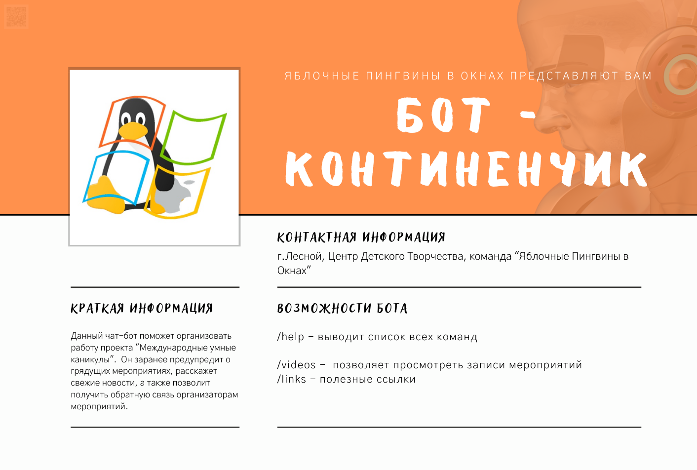

# Телеграм бот - Континенчик
Континенчик - это друг, который всегда напомнит о международных каникулах и отправит ссылку в нужный момент.


## Как работает бот
Участникам даётся ссылка на бота, в нём они указывают в какой они группе/потоке, восток или запапд. Имеется возможность добавление новых групп без переписывания кода. Информация хранится в базе данных, работающей на sqlite.
Сначала добавляются все мероприятия, затем включается бот. Он оповещает участников о событии в нужное время.

[Видео как работает бот](https://youtu.be/NuoJOB0i8CM)

[Ссылка на бота](https://t.me/kontinenchik_bot)

## Настройка бота
Настройки включаются в себя переменные окружения описанные в файле `example.env`, которые могут быть размещены в файле `.env`.
Настройки групп/потоков находятся в `main.py`.
Есть чистая база данных - `EXAMPLE.db`, она работает на sqlite.

## Запуск бота
Выполнить команды:
```shell
pip install -r
python main.py
```
